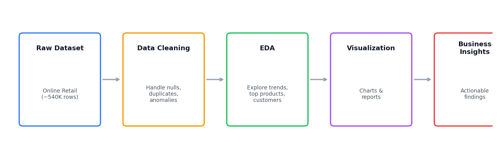

# 🛒 E-commerce Sales Analysis

A data analysis project exploring an online retail dataset to uncover sales trends, top products, top customers, and other actionable business insights — from raw data cleaning through exploratory data analysis (EDA) and visualization.


---

## Project Overview

This project analyzes an online retail dataset to uncover sales trends, top products, best customers, and other actionable business insights. It demonstrates key data science skills across the full analysis pipeline:

- **Data cleaning**
- **Exploratory data analysis (EDA)**
- **Visualization**
- **Business insight generation**



---

## Project Structure

```
ecom-sales-analysis/
├── data/          # Raw and cleaned datasets
├── notebooks/     # Jupyter notebooks for analysis
├── reports/       # Generated reports & summaries
│   └── images/    # Generated EDA visualizations
└── README.md      # Project documentation
```

---

## Dataset

- **Source:** [Kaggle – Online Retail Dataset](https://www.kaggle.com/datasets/vijayuv/onlineretail)
- **Rows:** ~540,000
- **Columns:** 8 — `InvoiceNo`, `StockCode`, `Description`, `Quantity`, `InvoiceDate`, `UnitPrice`, `CustomerID`, `Country`

---

## Tools & Libraries

- **Python**
- **Pandas** — data cleaning and manipulation
- **Matplotlib / Seaborn** — visualization
- **Jupyter Notebook** — interactive analysis

---

## Business Questions Answered

- What are the **top-selling products**?
- Which are the **top-spending countries**?
- Which are the **sales-peaking months and hours**?
- Who are the **top-spending customers**?

---

## Progress

-  Data cleaning and anomaly analysis complete
-  EDA visualizations and interpretations for the core business questions

---

## How to Use This Project

1. **Clone the repository**
   ```bash
   git clone https://github.com/ayishaliya/ecom-sales-analysis.git
   cd ecom-sales-analysis
   ```
2. **Explore the raw and cleaned data** in the `data/` folder
3. **Run the analysis** — open the notebooks in `notebooks/` with Jupyter to walk through the cleaning, EDA, and visualization steps yourself
4. **Review the findings** — generated charts and summaries live in `reports/images/` and `reports/`

---

## Conclusion

This project turns a large, messy retail transaction log into a clear set of business answers — which products sell, which countries and customers drive the most revenue, and when demand peaks. The structured notebook-to-report pipeline makes the analysis easy to reproduce or extend with new business questions.

---

 If you found this project useful, consider starring the repo!
